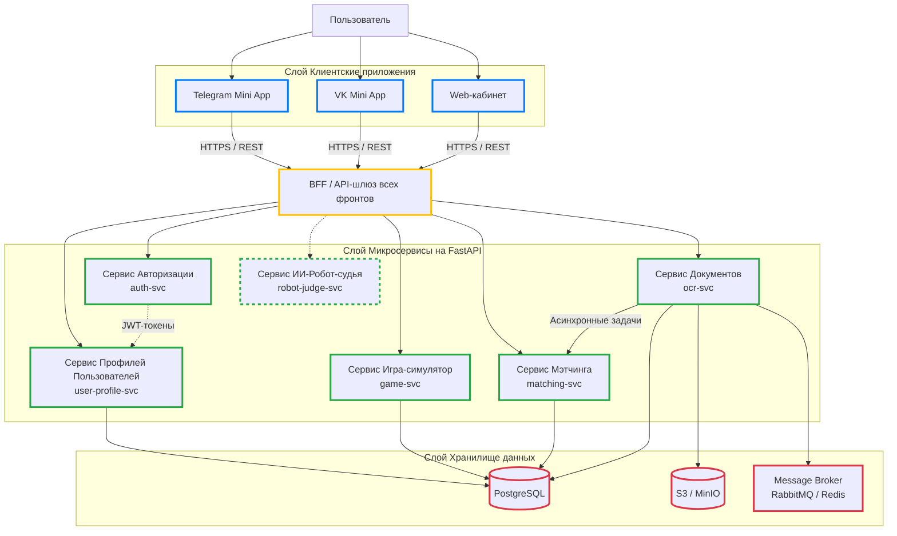
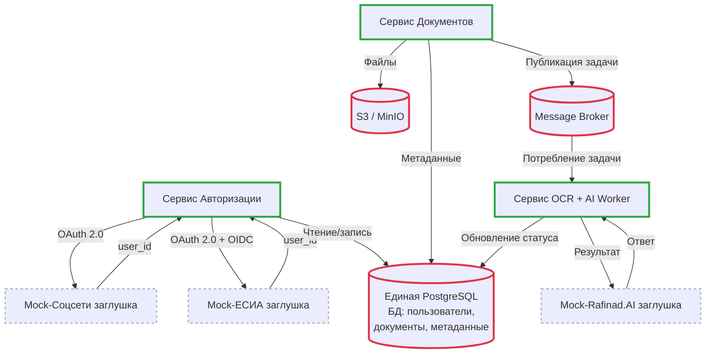

>Задание 1. Архитектура экосистемы
>Дано:
>>Экосистема состоит из нескольких частей:
>>- Игра-симулятор (лидогенерация и обучение пользователей).
>>- Cервис для мэтчинга пользователей.
>>- Модуль подготовки и подачи документов в суд (с интеграцией Rafinad.AI).
>>- Робот-судья (AI-ассистент, планируется в будущем).
>
>>Доступ к системе должен быть через:
>>- Telegram Mini App
>>- VK Mini App
>>- Web-кабинет
>>Backend на Python (FastAPI), предполагается микросервисная архитектура.
>
>>Нужно:
>>Схематично изобразить архитектуру (модули/сервисы и их взаимодействие).
>>Показать, как объединить все части в единую инфраструктуру:
>>- Авторизация (ЕСИА/соцсети).
>>- Базы данных и хранение документов.
>>- API-шлюз / коммуникация между сервисами.

>>Коротко объяснить, как решите проблему разных фронтов (Web, TG, VK).

### С помощью паттерна BFF 🟡

## Архитектура системы (цвета по слоям)

- **🔵 Клиенты** — Web, Telegram Mini App, VK Mini App  
- **🟡 BFF (API Gateway)** — единая точка входа, маршрутизация, JWT-валидация, rate limiting  
- **🟢 Микросервисы** — слабосвязанные, stateless, общаются через REST (синхронно) и Message Broker (асинхронно)  
  - `auth-svc` — OAuth 2.0 + OIDC с внешними провайдерами → выдача JWT  
  - `user-profile-svc` — управление профилем, ролями и прогрессом пользователя
  - `ocr-svc` — приём файлов, публикация задач в очередь, фоновый OCR  
  - `matching-svc` — подбор пар пользователей (истец/ответчик) по правилам и событиям
  - `game-svc` — игра симуляция судебных процессов для обучения и лидогенерации
  - `robot-judge-svc` —  AI-ассистент для анализа кейсов, оценки перспектив дела и генерации рекомендаций
- **🔴 Хранилище**  
  - **PostgreSQL** — единый кластер, изолированные схемы на сервис (пользователи, документы, мэтчи)  
  - **S3 / MinIO** — бинарные файлы (сканы, PDF)  
  - **Message Broker** (RabbitMQ / Redis) — асинхронные задачи  

## Авторизация

Клиент → **🟡 BFF** → **🟢 auth-svc** → (OAuth) → JWT → клиент.  

Все последующие запросы несут JWT → **🟡 BFF** валидирует → проксирует в нужный **🟢 микросервис** с `user_id`.

## Хранение

- Структурированные данные → **🔴 PostgreSQL**  
- Файлы → **🔴 S3 / MinIO**  
- Фоновые задачи → **🔴 Message Broker (Redis/Rabbit)**

>Задание 2. План запуска MVP
>Дано:
>>В проекте много сложных мест: разные требования у TG/VK Mini Apps,
>>внешние API (ФНС, ЕСИА), OCR и работа с документами.
>Нужно:
>>Назвать 3 главных риска, которые вы видите для проекта на этапе MVP.
>>Кратко предложить, как их минимизировать (например: использовать
>>заглушки для API, начать с одной платформы, применить готовый OCR).
>

## Ключевые риски 
1. Внешние API: ЕСИА можно только банкам, в исключения очень непросто попасть (Мой опыт в Солар тому подтверждение)
   - Банк партнер необходим 
2. Сервис доков будет очень долго делаться (много корнер кейсов)
   - Да нужно брать готовый OCR
3. Можно словить бан от VK
   - Начать с WEB онли и TG канала
   - Второй итерацией делаем бот TG