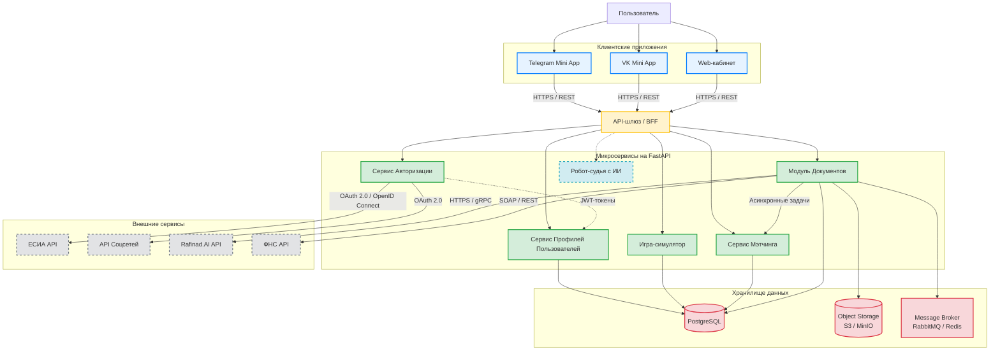

>Задание 1. Архитектура экосистемы
>Дано:
>>Экосистема состоит из нескольких частей:
>>- Игра-симулятор (лидогенерация и обучение пользователей).
>>- Cервис для мэтчинга пользователей.
>>- Модуль подготовки и подачи документов в суд (с интеграцией Rafinad.AI).
>>- Робот-судья (AI-ассистент, планируется в будущем).
>
>>Доступ к системе должен быть через:
>>- Telegram Mini App
>>- VK Mini App
>>- Web-кабинет
>>Backend на Python (FastAPI), предполагается микросервисная архитектура.
>
>>Нужно:
>>Схематично изобразить архитектуру (модули/сервисы и их взаимодействие).
>>Показать, как объединить все части в единую инфраструктуру:
>>- Авторизация (ЕСИА/соцсети).
>>- Базы данных и хранение документов.
>>- API-шлюз / коммуникация между сервисами.

>>Коротко объяснить, как решите проблему разных фронтов (Web, TG, VK).

>Задание 2. План запуска MVP
>Дано:
>>В проекте много сложных мест: разные требования у TG/VK Mini Apps,
>>внешние API (ФНС, ЕСИА), OCR и работа с документами.
>Нужно:
>>Назвать 3 главных риска, которые вы видите для проекта на этапе MVP.
>>Кратко предложить, как их минимизировать (например: использовать
>>заглушки для API, начать с одной платформы, применить готовый OCR).
>